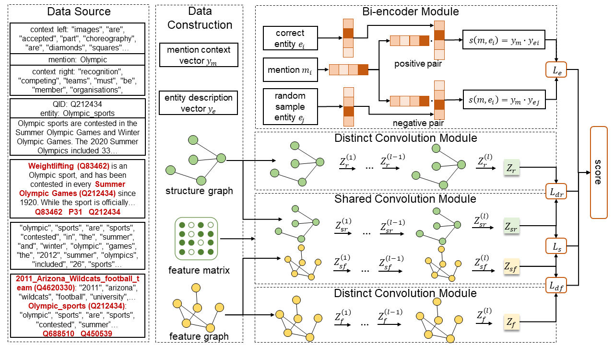

# TIGER-Temporally-Improved-Graph-Entity-Linker

The implementation of our approach is based on the original codebase [BLINK](https://github.com/facebookresearch/BLINK) and [AM-GCN](https://github.com/zhumeiqiBUPT/AM-GCN).<br>

<br><br>
<div align="center">

</div>
<br><br>

In this work, we introduce TIGER: a Temporally Improved Graph Entity Linker. By incorporating structural information between entities into the model, we enhance the learned representation, making entities more distinguishable over time. The core idea is to integrate graph-based information onto text-based information, from which both distinct and shared embeddings based on an entities' feature and structural relationships and their interaction. Experiments on three datasets, show that our model can effectively prevent temporal degradation, demonstrating a 2.55% performance boost over a strong baseline when the time gap is one year, and an improvement to 18.83% as the interval expands to nine years.

## Usage

Please follow the instructions next to reproduce our experiments, and to train a model with your own data.

### 1. Install the requirements

Creating a new environment (e.g. with `conda`) is recommended. Use `requirements.txt` to install the dependencies:

```
conda create -n tiger39 -y python=3.9 && conda activate tiger39
pip install -r requirements.txt
```

### 2. Download the data

| Download link                                                | Size |
| ------------------------------------------------------------ | ----------------- |
| [Our Dataset](https://drive.google.com/drive/folders/1DeHi-cvVOAdYFA4GljaBvpuG0wiYpgch?usp=sharing) | 3.12 GB            |
| [ZESHEL](https://github.com/facebookresearch/BLINK/tree/main/examples/zeshel) | 1.55 GB            |
| [WikiLinksNED](https://github.com/yasumasaonoe/ET4EL) | 1.1 GB             |

### 3. Reproduce the experiments

```
train.sh
```

<table class="tg">
<thead>
  <tr>
    <th class="tg-7btt" colspan="12">Only Forward</th>
  </tr>
</thead>
<tbody>
  <tr>
    <td class="tg-7btt"></td>
    <td class="tg-c3ow"></td>
    <td class="tg-c3ow">0</td>
    <td class="tg-c3ow">1</td>
    <td class="tg-c3ow">2</td>
    <td class="tg-c3ow">3</td>
    <td class="tg-c3ow">4</td>
    <td class="tg-c3ow">5</td>
    <td class="tg-c3ow">6</td>
    <td class="tg-c3ow">7</td>
    <td class="tg-c3ow">8</td>
    <td class="tg-c3ow">9</td>
  </tr>
  <tr>
    <td class="tg-7btt" rowspan="3">@1</td>
    <td class="tg-c3ow">BLINK</td>
    <td class="tg-c3ow">0.2169</td>
    <td class="tg-c3ow">0.2195</td>
    <td class="tg-c3ow">0.2128</td>
    <td class="tg-c3ow">0.2222</td>
    <td class="tg-c3ow">0.2214</td>
    <td class="tg-c3ow">0.2226</td>
    <td class="tg-c3ow">0.2223</td>
    <td class="tg-c3ow">0.2103</td>
    <td class="tg-c3ow">0.2204</td>
    <td class="tg-c3ow">0.2310</td>
  </tr>
  <tr>
    <td class="tg-c3ow">TIGER</td>
    <td class="tg-c3ow">0.2298</td>
    <td class="tg-c3ow">0.2251</td>
    <td class="tg-c3ow">0.2306</td>
    <td class="tg-c3ow">0.2318</td>
    <td class="tg-c3ow">0.2292</td>
    <td class="tg-c3ow">0.2250</td>
    <td class="tg-c3ow">0.2173</td>
    <td class="tg-c3ow">0.2251</td>
    <td class="tg-c3ow">0.2424</td>
    <td class="tg-c3ow">0.2745</td>
  </tr>
  <tr>
    <td class="tg-c3ow">Boost</td>
    <td class="tg-c3ow">5.95%</td>
    <td class="tg-c3ow">2.55%</td>
    <td class="tg-c3ow">8.36%</td>
    <td class="tg-c3ow">4.32%</td>
    <td class="tg-c3ow">3.52%</td>
    <td class="tg-c3ow">1.08%</td>
    <td class="tg-c3ow">-2.25%</td>
    <td class="tg-c3ow">7.04%</td>
    <td class="tg-c3ow">9.98%</td>
    <td class="tg-c3ow">18.83%</td>
  </tr>
  <tr>
    <td class="tg-7btt" rowspan="3">@2</td>
    <td class="tg-c3ow">BLINK</td>
    <td class="tg-c3ow">0.3104</td>
    <td class="tg-c3ow">0.3113</td>
    <td class="tg-c3ow">0.3065</td>
    <td class="tg-c3ow">0.3165</td>
    <td class="tg-c3ow">0.3125</td>
    <td class="tg-c3ow">0.3091</td>
    <td class="tg-c3ow">0.3016</td>
    <td class="tg-c3ow">0.2917</td>
    <td class="tg-c3ow">0.3024</td>
    <td class="tg-c3ow">0.3276</td>
  </tr>
  <tr>
    <td class="tg-c3ow">TIGER</td>
    <td class="tg-c3ow">0.3170</td>
    <td class="tg-c3ow">0.3172</td>
    <td class="tg-c3ow">0.3256</td>
    <td class="tg-c3ow">0.3226</td>
    <td class="tg-c3ow">0.3193</td>
    <td class="tg-c3ow">0.3188</td>
    <td class="tg-c3ow">0.3074</td>
    <td class="tg-c3ow">0.3278</td>
    <td class="tg-c3ow">0.3349</td>
    <td class="tg-c3ow">0.3607</td>
  </tr>
  <tr>
    <td class="tg-c3ow">Boost</td>
    <td class="tg-c3ow">2.13%</td>
    <td class="tg-c3ow">1.90%</td>
    <td class="tg-c3ow">6.23%</td>
    <td class="tg-c3ow">1.93%</td>
    <td class="tg-c3ow">2.18%</td>
    <td class="tg-c3ow">3.14%</td>
    <td class="tg-c3ow">1.92%</td>
    <td class="tg-c3ow">12.38%</td>
    <td class="tg-c3ow">10.75%</td>
    <td class="tg-c3ow">10.10%</td>
  </tr>
  <tr>
    <td class="tg-7btt" rowspan="3">@4</td>
    <td class="tg-c3ow">BLINK</td>
    <td class="tg-c3ow">0.4097</td>
    <td class="tg-c3ow">0.4099</td>
    <td class="tg-c3ow">0.4058</td>
    <td class="tg-c3ow">0.4188</td>
    <td class="tg-c3ow">0.4126</td>
    <td class="tg-c3ow">0.4076</td>
    <td class="tg-c3ow">0.4038</td>
    <td class="tg-c3ow">0.3908</td>
    <td class="tg-c3ow">0.3925</td>
    <td class="tg-c3ow">0.4290</td>
  </tr>
  <tr>
    <td class="tg-c3ow">TIGER</td>
    <td class="tg-c3ow">0.4144</td>
    <td class="tg-c3ow">0.4195</td>
    <td class="tg-c3ow">0.4273</td>
    <td class="tg-c3ow">0.4229</td>
    <td class="tg-c3ow">0.4198</td>
    <td class="tg-c3ow">0.4174</td>
    <td class="tg-c3ow">0.4100</td>
    <td class="tg-c3ow">0.4326</td>
    <td class="tg-c3ow">0.4338</td>
    <td class="tg-c3ow">0.4648</td>
  </tr>
  <tr>
    <td class="tg-c3ow">Boost</td>
    <td class="tg-c3ow">1.15%</td>
    <td class="tg-c3ow">2.34%</td>
    <td class="tg-c3ow">5.30%</td>
    <td class="tg-c3ow">0.98%</td>
    <td class="tg-c3ow">1.75%</td>
    <td class="tg-c3ow">2.40%</td>
    <td class="tg-c3ow">1.54%</td>
    <td class="tg-c3ow">10.70%</td>
    <td class="tg-c3ow">10.52%</td>
    <td class="tg-c3ow">8.34%</td>
  </tr>
  <tr>
    <td class="tg-7btt" rowspan="3">@8</td>
    <td class="tg-c3ow">BLINK</td>
    <td class="tg-c3ow">0.5117</td>
    <td class="tg-c3ow">0.5168</td>
    <td class="tg-c3ow">0.5116</td>
    <td class="tg-c3ow">0.5255</td>
    <td class="tg-c3ow">0.5160</td>
    <td class="tg-c3ow">0.5197</td>
    <td class="tg-c3ow">0.5176</td>
    <td class="tg-c3ow">0.5071</td>
    <td class="tg-c3ow">0.5017</td>
    <td class="tg-c3ow">0.5310</td>
  </tr>
  <tr>
    <td class="tg-c3ow">TIGER</td>
    <td class="tg-c3ow">0.5170</td>
    <td class="tg-c3ow">0.5292</td>
    <td class="tg-c3ow">0.5304</td>
    <td class="tg-c3ow">0.5304</td>
    <td class="tg-c3ow">0.5212</td>
    <td class="tg-c3ow">0.5216</td>
    <td class="tg-c3ow">0.5157</td>
    <td class="tg-c3ow">0.5388</td>
    <td class="tg-c3ow">0.5466</td>
    <td class="tg-c3ow">0.5710</td>
  </tr>
  <tr>
    <td class="tg-c3ow">Boost</td>
    <td class="tg-c3ow">1.04%</td>
    <td class="tg-c3ow">2.40%</td>
    <td class="tg-c3ow">3.67%</td>
    <td class="tg-c3ow">0.93%</td>
    <td class="tg-c3ow">1.01%</td>
    <td class="tg-c3ow">0.37%</td>
    <td class="tg-c3ow">-0.37%</td>
    <td class="tg-c3ow">6.25%</td>
    <td class="tg-c3ow">8.95%</td>
    <td class="tg-c3ow">7.53%</td>
  </tr>
  <tr>
    <td class="tg-7btt" rowspan="3">@16</td>
    <td class="tg-c3ow">BLINK</td>
    <td class="tg-c3ow">0.6148</td>
    <td class="tg-c3ow">0.6186</td>
    <td class="tg-c3ow">0.6182</td>
    <td class="tg-c3ow">0.6189</td>
    <td class="tg-c3ow">0.6220</td>
    <td class="tg-c3ow">0.6210</td>
    <td class="tg-c3ow">0.6288</td>
    <td class="tg-c3ow">0.6085</td>
    <td class="tg-c3ow">0.6159</td>
    <td class="tg-c3ow">0.6359</td>
  </tr>
  <tr>
    <td class="tg-c3ow">TIGER</td>
    <td class="tg-c3ow">0.6162</td>
    <td class="tg-c3ow">0.6297</td>
    <td class="tg-c3ow">0.6254</td>
    <td class="tg-c3ow">0.6248</td>
    <td class="tg-c3ow">0.6217</td>
    <td class="tg-c3ow">0.6234</td>
    <td class="tg-c3ow">0.6212</td>
    <td class="tg-c3ow">0.6393</td>
    <td class="tg-c3ow">0.6476</td>
    <td class="tg-c3ow">0.6697</td>
  </tr>
  <tr>
    <td class="tg-c3ow">Boost</td>
    <td class="tg-c3ow">0.23%</td>
    <td class="tg-c3ow">1.79%</td>
    <td class="tg-c3ow">1.16%</td>
    <td class="tg-c3ow">0.95%</td>
    <td class="tg-c3ow">-0.05%</td>
    <td class="tg-c3ow">0.39%</td>
    <td class="tg-c3ow">-1.21%</td>
    <td class="tg-c3ow">5.06%</td>
    <td class="tg-c3ow">5.15%</td>
    <td class="tg-c3ow">5.32%</td>
  </tr>
  <tr>
    <td class="tg-7btt" rowspan="3">@32</td>
    <td class="tg-c3ow">BLINK</td>
    <td class="tg-c3ow">0.7054</td>
    <td class="tg-c3ow">0.7146</td>
    <td class="tg-c3ow">0.7067</td>
    <td class="tg-c3ow">0.7106</td>
    <td class="tg-c3ow">0.7124</td>
    <td class="tg-c3ow">0.7143</td>
    <td class="tg-c3ow">0.7161</td>
    <td class="tg-c3ow">0.7053</td>
    <td class="tg-c3ow">0.7066</td>
    <td class="tg-c3ow">0.7503</td>
  </tr>
  <tr>
    <td class="tg-c3ow">TIGER</td>
    <td class="tg-c3ow">0.7022</td>
    <td class="tg-c3ow">0.7147</td>
    <td class="tg-c3ow">0.7135</td>
    <td class="tg-c3ow">0.7105</td>
    <td class="tg-c3ow">0.7090</td>
    <td class="tg-c3ow">0.7137</td>
    <td class="tg-c3ow">0.7085</td>
    <td class="tg-c3ow">0.7179</td>
    <td class="tg-c3ow">0.7366</td>
    <td class="tg-c3ow">0.7648</td>
  </tr>
  <tr>
    <td class="tg-c3ow">Boost</td>
    <td class="tg-c3ow">-0.45%</td>
    <td class="tg-c3ow">0.01%</td>
    <td class="tg-c3ow">0.96%</td>
    <td class="tg-c3ow">-0.01%</td>
    <td class="tg-c3ow">-0.48%</td>
    <td class="tg-c3ow">-0.08%</td>
    <td class="tg-c3ow">-1.06%</td>
    <td class="tg-c3ow">1.79%</td>
    <td class="tg-c3ow">4.25%</td>
    <td class="tg-c3ow">1.93%</td>
  </tr>
  <tr>
    <td class="tg-7btt" rowspan="3">@64</td>
    <td class="tg-c3ow">BLINK</td>
    <td class="tg-c3ow">0.7791</td>
    <td class="tg-c3ow">0.7911</td>
    <td class="tg-c3ow">0.7816</td>
    <td class="tg-c3ow">0.7809</td>
    <td class="tg-c3ow">0.7856</td>
    <td class="tg-c3ow">0.7927</td>
    <td class="tg-c3ow">0.7876</td>
    <td class="tg-c3ow">0.7805</td>
    <td class="tg-c3ow">0.7845</td>
    <td class="tg-c3ow">0.8214</td>
  </tr>
  <tr>
    <td class="tg-c3ow">TIGER</td>
    <td class="tg-c3ow">0.7818</td>
    <td class="tg-c3ow">0.7914</td>
    <td class="tg-c3ow">0.7886</td>
    <td class="tg-c3ow">0.7869</td>
    <td class="tg-c3ow">0.7940</td>
    <td class="tg-c3ow">0.7918</td>
    <td class="tg-c3ow">0.7866</td>
    <td class="tg-c3ow">0.7965</td>
    <td class="tg-c3ow">0.8107</td>
    <td class="tg-c3ow">0.8276</td>
  </tr>
  <tr>
    <td class="tg-c3ow">Boost</td>
    <td class="tg-c3ow">0.35%</td>
    <td class="tg-c3ow">0.04%</td>
    <td class="tg-c3ow">0.90%</td>
    <td class="tg-c3ow">0.77%</td>
    <td class="tg-c3ow">1.07%</td>
    <td class="tg-c3ow">-0.11%</td>
    <td class="tg-c3ow">-0.13%</td>
    <td class="tg-c3ow">2.05%</td>
    <td class="tg-c3ow">3.34%</td>
    <td class="tg-c3ow">0.75%</td>
  </tr>
  <tr>
    <th class="tg-7btt" colspan="12">Forward and Backward</td>
  </tr>
  <tr>
    <td class="tg-7btt" rowspan="3">@1</td>
    <td class="tg-c3ow">BLINK</td>
    <td class="tg-c3ow">0.2169</td>
    <td class="tg-c3ow">0.2222</td>
    <td class="tg-c3ow">0.2208</td>
    <td class="tg-c3ow">0.2247</td>
    <td class="tg-c3ow">0.2228</td>
    <td class="tg-c3ow">0.2205</td>
    <td class="tg-c3ow">0.2216</td>
    <td class="tg-c3ow">0.2197</td>
    <td class="tg-c3ow">0.2147</td>
    <td class="tg-c3ow">0.2114</td>
  </tr>
  <tr>
    <td class="tg-c3ow">TIGER</td>
    <td class="tg-c3ow">0.2298</td>
    <td class="tg-c3ow">0.2220</td>
    <td class="tg-c3ow">0.2248</td>
    <td class="tg-c3ow">0.2232</td>
    <td class="tg-c3ow">0.2261</td>
    <td class="tg-c3ow">0.2234</td>
    <td class="tg-c3ow">0.2190</td>
    <td class="tg-c3ow">0.2258</td>
    <td class="tg-c3ow">0.2307</td>
    <td class="tg-c3ow">0.2466</td>
  </tr>
  <tr>
    <td class="tg-c3ow">Boost</td>
    <td class="tg-c3ow">5.95%</td>
    <td class="tg-c3ow">-0.09%</td>
    <td class="tg-c3ow">1.81%</td>
    <td class="tg-c3ow">-0.67%</td>
    <td class="tg-c3ow">1.48%</td>
    <td class="tg-c3ow">1.32%</td>
    <td class="tg-c3ow">-1.17%</td>
    <td class="tg-c3ow">2.78%</td>
    <td class="tg-c3ow">7.45%</td>
    <td class="tg-c3ow">16.65%</td>
  </tr>
  <tr>
    <td class="tg-7btt" rowspan="3">@2</td>
    <td class="tg-c3ow">BLINK</td>
    <td class="tg-c3ow">0.3104</td>
    <td class="tg-c3ow">0.3135</td>
    <td class="tg-c3ow">0.3139</td>
    <td class="tg-c3ow">0.3182</td>
    <td class="tg-c3ow">0.3139</td>
    <td class="tg-c3ow">0.3093</td>
    <td class="tg-c3ow">0.3109</td>
    <td class="tg-c3ow">0.3065</td>
    <td class="tg-c3ow">0.2988</td>
    <td class="tg-c3ow">0.2987</td>
  </tr>
  <tr>
    <td class="tg-c3ow">TIGER</td>
    <td class="tg-c3ow">0.3170</td>
    <td class="tg-c3ow">0.3141</td>
    <td class="tg-c3ow">0.3189</td>
    <td class="tg-c3ow">0.3133</td>
    <td class="tg-c3ow">0.3165</td>
    <td class="tg-c3ow">0.3188</td>
    <td class="tg-c3ow">0.3161</td>
    <td class="tg-c3ow">0.3217</td>
    <td class="tg-c3ow">0.3235</td>
    <td class="tg-c3ow">0.3266</td>
  </tr>
  <tr>
    <td class="tg-c3ow">Boost</td>
    <td class="tg-c3ow">2.13%</td>
    <td class="tg-c3ow">0.19%</td>
    <td class="tg-c3ow">1.59%</td>
    <td class="tg-c3ow">-1.54%</td>
    <td class="tg-c3ow">0.83%</td>
    <td class="tg-c3ow">3.07%</td>
    <td class="tg-c3ow">1.67%</td>
    <td class="tg-c3ow">4.96%</td>
    <td class="tg-c3ow">8.27%</td>
    <td class="tg-c3ow">9.34%</td>
  </tr>
  <tr>
    <td class="tg-7btt" rowspan="3">@4</td>
    <td class="tg-c3ow">BLINK</td>
    <td class="tg-c3ow">0.4097</td>
    <td class="tg-c3ow">0.4115</td>
    <td class="tg-c3ow">0.4128</td>
    <td class="tg-c3ow">0.4198</td>
    <td class="tg-c3ow">0.4104</td>
    <td class="tg-c3ow">0.4090</td>
    <td class="tg-c3ow">0.4085</td>
    <td class="tg-c3ow">0.4024</td>
    <td class="tg-c3ow">0.3907</td>
    <td class="tg-c3ow">0.3990</td>
  </tr>
  <tr>
    <td class="tg-c3ow">TIGER</td>
    <td class="tg-c3ow">0.4144</td>
    <td class="tg-c3ow">0.4145</td>
    <td class="tg-c3ow">0.4185</td>
    <td class="tg-c3ow">0.4126</td>
    <td class="tg-c3ow">0.4158</td>
    <td class="tg-c3ow">0.4204</td>
    <td class="tg-c3ow">0.4150</td>
    <td class="tg-c3ow">0.4202</td>
    <td class="tg-c3ow">0.4193</td>
    <td class="tg-c3ow">0.4335</td>
  </tr>
  <tr>
    <td class="tg-c3ow">Boost</td>
    <td class="tg-c3ow">1.15%</td>
    <td class="tg-c3ow">0.73%</td>
    <td class="tg-c3ow">1.38%</td>
    <td class="tg-c3ow">-1.72%</td>
    <td class="tg-c3ow">1.32%</td>
    <td class="tg-c3ow">2.79%</td>
    <td class="tg-c3ow">1.59%</td>
    <td class="tg-c3ow">4.42%</td>
    <td class="tg-c3ow">7.32%</td>
    <td class="tg-c3ow">8.65%</td>
  </tr>
  <tr>
    <td class="tg-7btt" rowspan="3">@8</td>
    <td class="tg-c3ow">BLINK</td>
    <td class="tg-c3ow">0.5117</td>
    <td class="tg-c3ow">0.5146</td>
    <td class="tg-c3ow">0.5180</td>
    <td class="tg-c3ow">0.5238</td>
    <td class="tg-c3ow">0.5144</td>
    <td class="tg-c3ow">0.5171</td>
    <td class="tg-c3ow">0.5164</td>
    <td class="tg-c3ow">0.5116</td>
    <td class="tg-c3ow">0.5002</td>
    <td class="tg-c3ow">0.4890</td>
  </tr>
  <tr>
    <td class="tg-c3ow">TIGER</td>
    <td class="tg-c3ow">0.5170</td>
    <td class="tg-c3ow">0.5182</td>
    <td class="tg-c3ow">0.5216</td>
    <td class="tg-c3ow">0.5206</td>
    <td class="tg-c3ow">0.5182</td>
    <td class="tg-c3ow">0.5208</td>
    <td class="tg-c3ow">0.5176</td>
    <td class="tg-c3ow">0.5229</td>
    <td class="tg-c3ow">0.5235</td>
    <td class="tg-c3ow">0.5362</td>
  </tr>
  <tr>
    <td class="tg-c3ow">Boost</td>
    <td class="tg-c3ow">1.04%</td>
    <td class="tg-c3ow">0.70%</td>
    <td class="tg-c3ow">0.69%</td>
    <td class="tg-c3ow">-0.61%</td>
    <td class="tg-c3ow">0.74%</td>
    <td class="tg-c3ow">0.72%</td>
    <td class="tg-c3ow">0.23%</td>
    <td class="tg-c3ow">2.21%</td>
    <td class="tg-c3ow">4.66%</td>
    <td class="tg-c3ow">9.65%</td>
  </tr>
  <tr>
    <td class="tg-7btt" rowspan="3">@16</td>
    <td class="tg-c3ow">BLINK</td>
    <td class="tg-c3ow">0.6148</td>
    <td class="tg-c3ow">0.6141</td>
    <td class="tg-c3ow">0.6205</td>
    <td class="tg-c3ow">0.6224</td>
    <td class="tg-c3ow">0.6181</td>
    <td class="tg-c3ow">0.6118</td>
    <td class="tg-c3ow">0.6192</td>
    <td class="tg-c3ow">0.6089</td>
    <td class="tg-c3ow">0.6035</td>
    <td class="tg-c3ow">0.5876</td>
  </tr>
  <tr>
    <td class="tg-c3ow">TIGER</td>
    <td class="tg-c3ow">0.6162</td>
    <td class="tg-c3ow">0.6180</td>
    <td class="tg-c3ow">0.6178</td>
    <td class="tg-c3ow">0.6176</td>
    <td class="tg-c3ow">0.6186</td>
    <td class="tg-c3ow">0.6187</td>
    <td class="tg-c3ow">0.6150</td>
    <td class="tg-c3ow">0.6263</td>
    <td class="tg-c3ow">0.6233</td>
    <td class="tg-c3ow">0.6345</td>
  </tr>
  <tr>
    <td class="tg-c3ow">Boost</td>
    <td class="tg-c3ow">0.23%</td>
    <td class="tg-c3ow">0.64%</td>
    <td class="tg-c3ow">-0.44%</td>
    <td class="tg-c3ow">-0.77%</td>
    <td class="tg-c3ow">0.08%</td>
    <td class="tg-c3ow">1.13%</td>
    <td class="tg-c3ow">-0.68%</td>
    <td class="tg-c3ow">2.86%</td>
    <td class="tg-c3ow">3.28%</td>
    <td class="tg-c3ow">7.98%</td>
  </tr>
  <tr>
    <td class="tg-7btt" rowspan="3">@32</td>
    <td class="tg-c3ow">BLINK</td>
    <td class="tg-c3ow">0.7054</td>
    <td class="tg-c3ow">0.7077</td>
    <td class="tg-c3ow">0.7088</td>
    <td class="tg-c3ow">0.7140</td>
    <td class="tg-c3ow">0.7076</td>
    <td class="tg-c3ow">0.7044</td>
    <td class="tg-c3ow">0.7048</td>
    <td class="tg-c3ow">0.7025</td>
    <td class="tg-c3ow">0.6966</td>
    <td class="tg-c3ow">0.6897</td>
  </tr>
  <tr>
    <td class="tg-c3ow">TIGER</td>
    <td class="tg-c3ow">0.7022</td>
    <td class="tg-c3ow">0.7058</td>
    <td class="tg-c3ow">0.7088</td>
    <td class="tg-c3ow">0.7056</td>
    <td class="tg-c3ow">0.7065</td>
    <td class="tg-c3ow">0.7066</td>
    <td class="tg-c3ow">0.7011</td>
    <td class="tg-c3ow">0.7076</td>
    <td class="tg-c3ow">0.7124</td>
    <td class="tg-c3ow">0.7221</td>
  </tr>
  <tr>
    <td class="tg-c3ow">Boost</td>
    <td class="tg-c3ow">-0.45%</td>
    <td class="tg-c3ow">-0.27%</td>
    <td class="tg-c3ow">0.00%</td>
    <td class="tg-c3ow">-1.18%</td>
    <td class="tg-c3ow">-0.16%</td>
    <td class="tg-c3ow">0.31%</td>
    <td class="tg-c3ow">-0.52%</td>
    <td class="tg-c3ow">0.73%</td>
    <td class="tg-c3ow">2.27%</td>
    <td class="tg-c3ow">4.70%</td>
  </tr>
  <tr>
    <td class="tg-7btt" rowspan="3">@64</td>
    <td class="tg-c3ow">BLINK</td>
    <td class="tg-c3ow">0.7791</td>
    <td class="tg-c3ow">0.7867</td>
    <td class="tg-c3ow">0.7858</td>
    <td class="tg-c3ow">0.7896</td>
    <td class="tg-c3ow">0.7836</td>
    <td class="tg-c3ow">0.7807</td>
    <td class="tg-c3ow">0.7768</td>
    <td class="tg-c3ow">0.7781</td>
    <td class="tg-c3ow">0.7743</td>
    <td class="tg-c3ow">0.7721</td>
  </tr>
  <tr>
    <td class="tg-c3ow">TIGER</td>
    <td class="tg-c3ow">0.7818</td>
    <td class="tg-c3ow">0.7830</td>
    <td class="tg-c3ow">0.7862</td>
    <td class="tg-c3ow">0.7834</td>
    <td class="tg-c3ow">0.7905</td>
    <td class="tg-c3ow">0.7839</td>
    <td class="tg-c3ow">0.7825</td>
    <td class="tg-c3ow">0.7907</td>
    <td class="tg-c3ow">0.7917</td>
    <td class="tg-c3ow">0.7931</td>
  </tr>
  <tr>
    <td class="tg-c3ow">Boost</td>
    <td class="tg-c3ow">0.35%</td>
    <td class="tg-c3ow">-0.47%</td>
    <td class="tg-c3ow">0.05%</td>
    <td class="tg-c3ow">-0.79%</td>
    <td class="tg-c3ow">0.88%</td>
    <td class="tg-c3ow">0.41%</td>
    <td class="tg-c3ow">0.73%</td>
    <td class="tg-c3ow">1.62%</td>
    <td class="tg-c3ow">2.25%</td>
    <td class="tg-c3ow">2.72%</td>
  </tr>
</tbody>
</table>

## Using your own data

If you want to use your own dataset, you only need to use the code in Dataset Construction. Construct your own dataset according to the description of the dataset construction process in the Supplementary Material.
