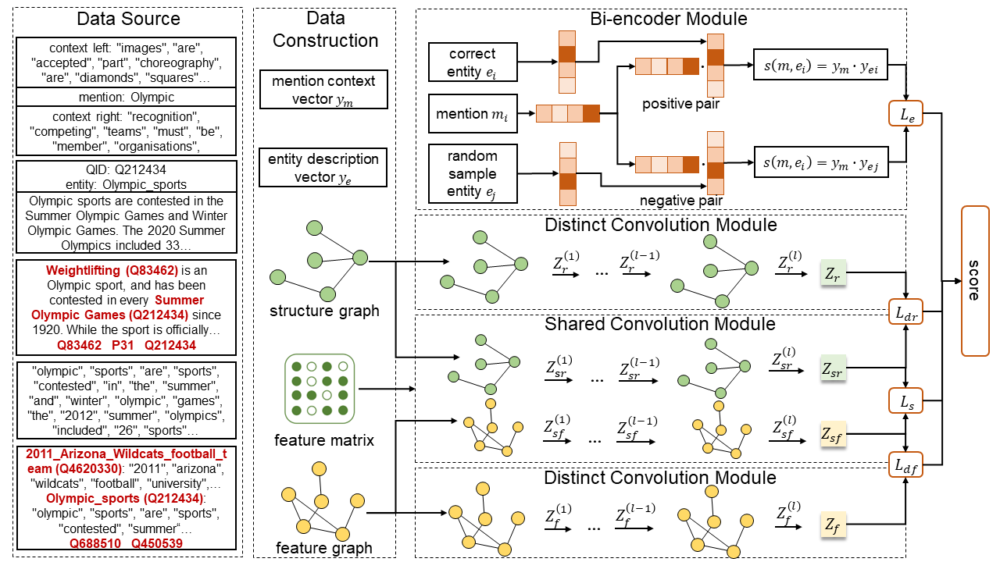

<div align="center">

# TIGER: Temporally Improved Graph Entity Linker

<a href="https://doi.org/10.3233/FAIA240933"></a>
<a href="https://pengyu-zhang.github.io/pdf/TIGER.pdf"></a>
<a href="https://zenodo.org/records/10977757"></a>
<a href="LICENSE"></a>



</div>

Entity linking models degrade as a knowledge graph moves away from the
state they were trained on: entity descriptions drift and new entities
appear. TIGER, published at ECAI 2024, counters this temporal
degradation by injecting structural information about entities into a
BLINK-style bi-encoder during training. Inference stays purely
text-based, so the deployed model is a standard bi-encoder.

## Overview

Each entity participates in two graphs — a structure graph built from
Wikidata5M relations and a feature graph built from kNN similarity of
entity-description embeddings — and a keyword-based feature matrix.
Distinct and shared graph convolution modules extract what is unique to
and common across the two graphs, a consistency loss and an HSIC-based
distinction loss shape the shared/unique embeddings, and a fusion term
aligns entity text embeddings with their graph embeddings.

## Repository structure

```text
├── assets/           # figures used in this README
├── configs/          # experiment configurations (baseline / paper / default)
├── data/             # dataset documentation (payloads are downloaded, not tracked)
├── scripts/          # setup, data, training, evaluation, smoke test
├── src/              # the tiger package: model, graph modules, training, evaluation
└── requirements.txt
```

## Installation

Requires Python 3.10+ and a PyTorch build matching your hardware:

```bash
CUDA_TAG=cu132 bash scripts/setup_env.sh   # pick your CUDA tag, or CUDA_TAG=cpu
```

## Data

```bash
bash scripts/prepare_data.sh                       # years 2019-2022 (~911 MB download)
YEARS=2013,2014,2015,2016,2017,2018,2019,2020,2021,2022 bash scripts/prepare_data.sh
```

The script downloads Graph-TempEL from the official
[Zenodo record](https://zenodo.org/records/10977757) (CC-BY-4.0), falls
back to this repository's GitHub Release mirror if Zenodo is
unreachable, verifies MD5 checksums, and builds the processed layout
with alignment validation. Graph-TempEL combines
[TempEL](https://cloud.ilabt.imec.be/index.php/s/RinXy8NgqdW58RW) with
entity relationships from
[Wikidata5M](https://deepgraphlearning.github.io/project/wikidata5m);
each yearly snapshot provides 1,764-sample training sets (new and
continual entities), ~43k validation and ~48k test mentions, and the
per-year graphs. See [data/README.md](data/README.md) for details,
including the ZESHEL and WikiLinksNED datasets used in the paper.

## 🚀 Quick start

After installation and data preparation, verify the whole pipeline on a
small slice of the real data (finishes in minutes):

```bash
bash scripts/smoke_test.sh
```

## Training and evaluation

```bash
bash scripts/train.sh    configs/default.yaml new_entities 2019
bash scripts/evaluate.sh configs/default.yaml outputs/default/new_entities/2019 2019,2020,2021,2022
bash scripts/run_all.sh                                  # full train/test matrix, resumable
```

Three configurations are provided:

| Config | Purpose |
| --- | --- |
| `configs/baseline.yaml` | Plain BLINK bi-encoder baseline without the paper's graph components, for controlled comparison. |
| `configs/paper.yaml` | Faithful configuration of the published method. |
| `configs/default.yaml` | Recommended configuration (paper method plus engineering improvements, each behind a switch). |

Evaluation prints recall@{1,2,4,8,16,32,64} against the full yearly
candidate pool and writes them to `results_test.jsonl` in the model
directory.

## 📊 Results

Quantitative results are reported in the
[paper](https://doi.org/10.3233/FAIA240933).

## 📝 Citation

```bibtex
@inproceedings{zhang2024tiger,
  title     = {{TIGER}: Temporally Improved Graph Entity Linker},
  author    = {Zhang, Pengyu and Cao, Congfeng and Groth, Paul},
  booktitle = {ECAI 2024 - 27th European Conference on Artificial Intelligence},
  series    = {Frontiers in Artificial Intelligence and Applications},
  volume    = {392},
  pages     = {3733--3740},
  publisher = {IOS Press},
  year      = {2024},
  doi       = {10.3233/FAIA240933}
}
```

## 🙏 Acknowledgments & License

This implementation builds on
[BLINK](https://github.com/facebookresearch/BLINK) and
[AM-GCN](https://github.com/zhumeiqiBUPT/AM-GCN).

This repository is released under the [MIT License](LICENSE).

---

Maintained by [Pengyu Zhang](https://pengyu-zhang.github.io/).
